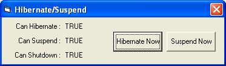

<div align="center">

## Hibernate/Suspend


</div>

### Description

A simple program showing how to hibernate or suspend Windows if the hardware is enabled and is supported.
 
### More Info
 
Works for Windows ME, XP, 2000, and 2003. Feel free to use these codes in your projects :)

Btw, it might not work if the current user do not have the privilage to execute the requested task.


<span>             |<span>
---                |---
**Submitted On**   |2006-09-29 06:10:02
**By**             |[kwyap](https://github.com/Planet-Source-Code/PSCIndex/blob/master/ByAuthor/kwyap.md)
**Level**          |Beginner
**User Rating**    |5.0 (15 globes from 3 users)
**Compatibility**  |VB 6\.0
**Category**       |[Complete Applications](https://github.com/Planet-Source-Code/PSCIndex/blob/master/ByCategory/complete-applications__1-27.md)
**World**          |[Visual Basic](https://github.com/Planet-Source-Code/PSCIndex/blob/master/ByWorld/visual-basic.md)
**Archive File**   |[Hibernate\_2022359292006\.zip](https://github.com/Planet-Source-Code/kwyap-hibernate-suspend__1-66669/archive/master.zip)

### API Declarations

```
' Determines whether the computer supports hibernation
Private Declare Function IsPwrHibernateAllowed Lib "powrprof.dll" () As Long
' Determines whether the computer supports the sleep states
Private Declare Function IsPwrSuspendAllowed Lib "powrprof.dll" () As Long
' Determines whether the computer supports the soft off power state
Private Declare Function IsPwrShutdownAllowed Lib "powrprof.dll" () As Long
' Suspends the system by shutting power down
'  Hibernate - If this parameter is TRUE, the system hibernates. If the parameter is FALSE, the system is suspended
Private Declare Function SetSuspendState Lib "powrprof.dll" (ByVal Hibernate As Long, ByVal ForceCritical As Long, ByVal DisableWakeEvent As Long) As Long
```


